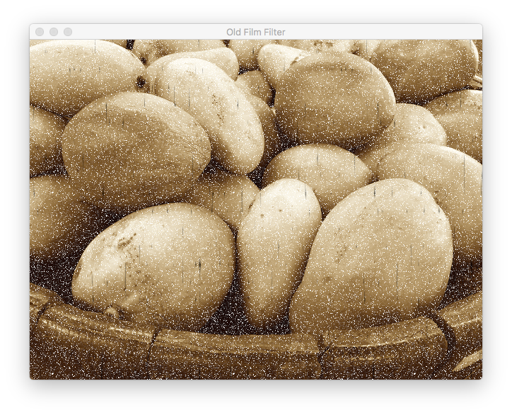

# Olde Film Filter Recipe

 
 

The source code of the first demo (Old Film Filter) is based on Apple's available documentation, online or distributed with XCode 8.x.

 
 

**Expected Output:**

**Old Movie**

Applies the filter from Demo 1 to play a short movie clip.

 
 

**Requirements:**

XCode 8.x, Swift 3.0

Deployment Target: macOS 10.12.

 
 

**References:**

1) Core Image Programming Guide - Subclassing CIFilter: Recipes for Custom Effects

https://developer.apple.com/library/archive/documentation/GraphicsImaging/Conceptual/CoreImaging/ci_filer_recipes/ci_filter_recipes.html#/

2) Latest online documentation on "Simulating Scratchy Analog Film":

https://developer.apple.com/documentation/coreimage/simulating_scratchy_analog_film

3) CIFunHouse - Olde Film module.

https://developer.apple.com/library/etc/redirect/xcode/content/1189/samplecode/CIFunHouse/Introduction/Intro.html
